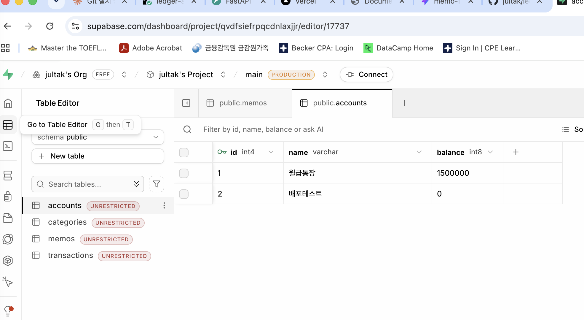
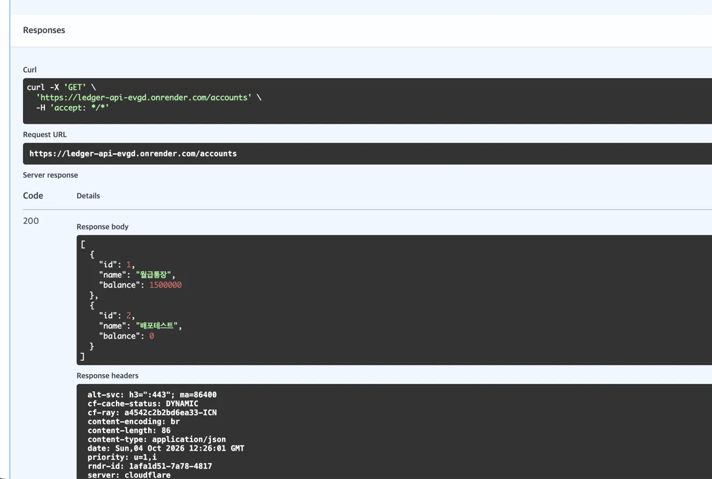

# ledger-api — 가계부 API (FastAPI + SQLAlchemy + Supabase, Render 배포)

## 프로젝트 소개
- 계좌·카테고리·거래를 저장·조회·집계하는 가계부 REST API
- FastAPI + SQLAlchemy(ORM)로 구현, 데이터는 Supabase(클라우드 PostgreSQL)에 저장
- GitHub → Render 자동 배포, 환경변수(`DATABASE_URL`)로 Supabase에 연결

## 구성

- 백엔드 : FastAPI (`main.py`), 경로: 계좌 생성/목록/단건, 거래 생성, 계좌 상세(중첩), 카테고리별 집계 
- DB 접근 : SQLAlchemy 2.x (`models.py` 테이블, `schemas.py` 입출력, `database.py` 연결) 
- 데이터베이스 : Supabase PostgreSQL (Session pooler, `postgresql+psycopg://`) 
- 배포 : Render Web Service (Free) 

## 주소
- GitHub: https://github.com/jultak/ledger-api
- Render API 문서: https://ledger-api-evgd.onrender.com/docs

## ① 결과 확인
- Supabase Table Editor `accounts` 테이블에 월급통장(1,500,000), 배포테스트(0) 행이 저장되어 있음
- Render 주소 `/docs`에서 `GET /accounts` 실행 → 200, 위 두 계좌가 같은 값으로 조회됨 (Render의 API가 Supabase를 읽고 쓰는 것 확인)

## ② 핵심 개념 
- **계좌·거래를 두 테이블로 나눈 이유 (1:N)**: 계좌 하나에 거래가 여러 건이 발생할 수 있으므로, 계좌 정보는 한 번만 저장하고 거래는 `account_id`(외래키)로 계좌를 가리키게 해서 중복 및 잘못된 데이터(없는 계좌에서의 거래)를 막는다.
- **모델 클래스와 테이블의 대응**: `models.py`의 클래스 하나가 테이블 하나, 클래스 속성이 열이 된다. `Base.metadata.create_all()`이 이 정의대로 Supabase에 테이블을 만든다. (`models.py`는 DB 저장 방식, `schemas.py`는 API 입출력 형식을 정의한다.)
- **연결 문자열을 `.env`로 분리하는 이유**: 비밀번호가 들어 있어 코드·GitHub에 올리면 안 되고(`.gitignore`로 제외), 로컬(`.env`)과 배포(Render 환경변수)에서 코드 수정 없이 값만 바꿔 쓰기 위해서다.

## ③ 자유 로그
### 막힌 곳과 푼 과정
- 가상환경(`.venv`)을 프로젝트 폴더가 아닌 다른 위치에 만들어 `ledger-api` 안에 `.venv`가 없었음 → 잘못 만든 `.venv`를 지우고 `ledger-api` 폴더 안에서 다시 생성
- `ModuleNotFoundError: No module named 'pydantic'` → `.venv`를 만들기만 하고 `pip install -r requirements.txt`를 실행하지 않았던 것이 원인. 설치 후 해결. (그전에는 서버가 conda `(base)`에서 돌고 있어 에러가 보이지 않았음)
- `schemas.py`에 빨간 줄 → `class TransactionCreate`가 한 단계 더 들여쓰기되어 있었음 → Shift+Tab으로 정렬
- `Address already in use` → 이전에 켠 서버가 8000 포트를 쓰고 있었음 → 그 서버를 끄거나 `--port 8001` 사용
- Swagger에서 "Example Value"를 실제 결과로 착각 → Try it out → Execute를 눌러야 실제 응답이 나옴
- Render 저장소 목록에 새 저장소가 안 보임 → GitHub의 Render 앱 설정(Configure)에서 저장소 접근 허용

### 확인한 것 (AI 활용 검증)
- AI(Claude)에게 에러 메시지·스크린샷을 보여주고 원인을 물었고, 제안은 그대로 믿지 않고 직접 실행해 확인함
- 검증 방법: `git status`로 `.env`가 올라가지 않는지 확인, Render 로그에서 PostgreSQL 쿼리 확인(SQLite였다면 `PRAGMA`가 보임), Supabase Table Editor의 실제 데이터와 `/docs`의 응답 값 대조

### 아직 궁금한 것
- Render 무료 플랜은 첫 접속이 느린데(콜드 스타트), 3주차 배포와 달리 데이터는 Supabase에 남아 있어 사라지지 않는다. 아직 헷갈리는게 많다..